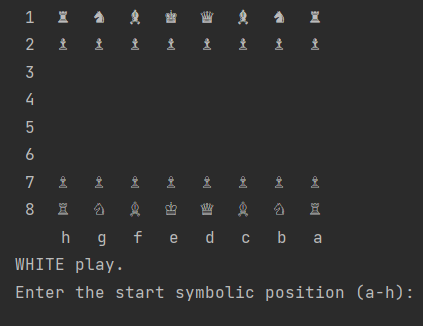
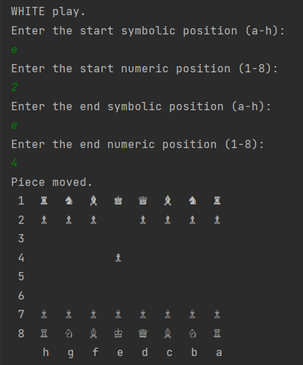

# Chess Game

#### Prerequisites:

- Maven
- Java 11+
### To start a game call GameStarter.java class main method.

### 1. Once the app started, the console prints initial board

### 2. To make a move follow instructions in the console. Classic opening example: 

### 3. After each valid move the turn is given to the opposite color player.

### 4. If you've made misprint while moving, the system will give you a chance to enter new move until it's valid.
### 5. Enjoy.

